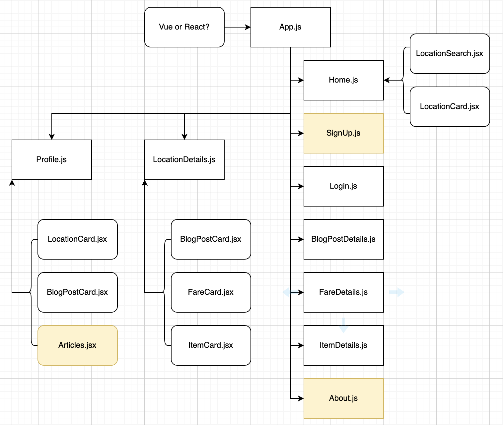

# Shop - Travel - Work

## A Digital Nomad Community

---

## Date: 9/1/2022 - 9/14/2022

---

### Created by Patrick Knight

[Patrick Knight](https://www.linkedin.com/in/patrick-f-knight/)

---

### **_Project Links_**

[Trello](https://trello.com/b/OW6x9FLC/ga-capstone) | [Deployment]

---

### Description

---

### Technologies

* Django/Python3
* PostgreSQL
* ???

---

### Screenshots

#### **_Component Hierarchy_**

---

### Getting Started

- `Fork` & `Clone` this repository.
- `npm i` to install necessary dependencies.

#### Dependencies include react, react-dom, react-router-dom, and axios. These should already be in the package.json files, but will be good to make sure. Please make sure that your local machine has the proper installations for these, as well.

### `npm start`

Runs the app in the development mode.\
Open [http://localhost:3000](http://localhost:3000) to view it in your browser.

---

### Future Updates

- [ ] One
- [x] ~~Two~~

---

### Credits

#### Created as a part of the General Assembly - SEI program.

* My wife, Tara, for inspiration