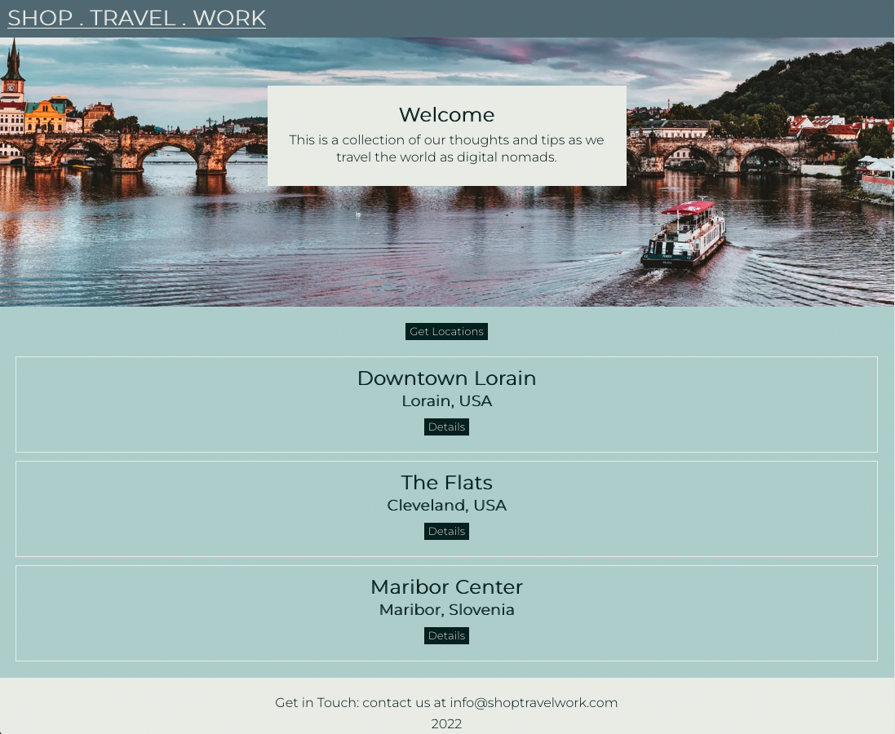
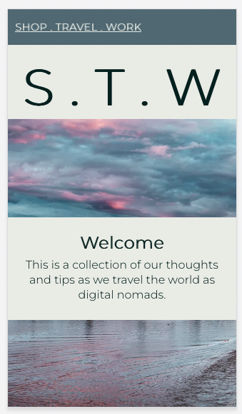

# Shop - Travel - Work

## A Digital Nomad Community

---

## Date: 9/1/2022 - 9/14/2022

---

### Created by Patrick Knight

[Patrick Knight](https://www.linkedin.com/in/patrick-f-knight/)

---

### **_Project Links_**

[Trello](https://trello.com/b/OW6x9FLC/ga-capstone) | [Deployment](https://frozen-mesa-98703.herokuapp.com/)

### **_Frontend Repository_**

[STW Server](https://github.com/pfknight8/shop_travel_work)

---

### Description

#### This is my capstone project for General Assembly - SEI program. This website aims to serve as a place for Digital Nomads to gather (whether practicing or aspiring). Remote work has had a great amount of growth these days, and one of the potential benefits of being offsite is that one can technically work from anywhere. This has led to the concept of the 'digital nomad,' where one no longer has to wait for a suitable vacation window to go and see the world, but can go anywhere with reliable internet and still be able to work.
#### The objective of this site is for people to encourage each other to take the opportunity to go and experience the world while they have the opportunity. Post places that you've been, what local fare to expect, and what types of local crafts are available to browse.
#### The initial build will be limited to myself and my wife, but expansion to a community website is the ultimate stretch goal. Please feel free to check back every once in a while to see my progress.

---

### Technologies

* React
* Redux
* Node

---

### Screenshots

#### **_Component Hierarchy_**

#### **_Working Screenshots_**

---

### Getting Started

- `Fork` & `Clone` this repository.
- `npm i` to install necessary dependencies.

#### Dependencies include react, react-dom, react-router-dom, @reduxjs/toolkit, react-redux, and axios. These should already be in the package.json files, but will be good to make sure. Please make sure that your local machine has the proper installations for these, as well.

### `npm start`

#### Runs the app in the development mode. Open http://localhost:3000 to view it in your browser.

---

### Future Updates

- [x] ~~Design to be mobile friendly~~
- [ ] Add 'interesting articles' section (about working remotely)
- [ ] Implement search features for appropriate data models
- [ ] Add an interactive map to display locations
- [ ] Implement 3rd party API to control country/state/city selection on form(s)
- [ ] Implement user functionality on site

---

### Credits

#### Created as a part of the General Assembly - SEI program.

#### Without access to various helpful materials, this project would never have left the ground...especially since I taught myself Redux as a part of it. My thanks goes out to the people who have taken the time to assemble and maintain these resources, as well as answer the questions posted on these sites.

* Redux.org [Docs](https://redux.js.org/)
*  [Hackernoon](https://hackernoon.com/110percent-complete-jwt-authentication-with-django-and-react-2020-iejq34ta)
* This [article](https://blog.logrocket.com/handling-user-authentication-redux-toolkit/) on LogRocket
* This Lightrains [article](https://lightrains.com/blogs/axios-intercepetors-react/) on Axios interceptors
* freeCodeCamp [article](https://www.freecodecamp.org/news/how-to-manage-state-in-a-react-app/#reduxtoolkit) on the Redux toolkit
* This helpful [overview](https://blog.bitsrc.io/simplifying-redux-with-redux-toolkit-6236c28cdfcb) to help understand Redux toolkit
* imgur user mihac1886 for an image
* And of course, many visits to [stackoverflow](https://stackoverflow.com/)

#### I'll also include my wife, Tara, for inspiration on choosing this project topic.